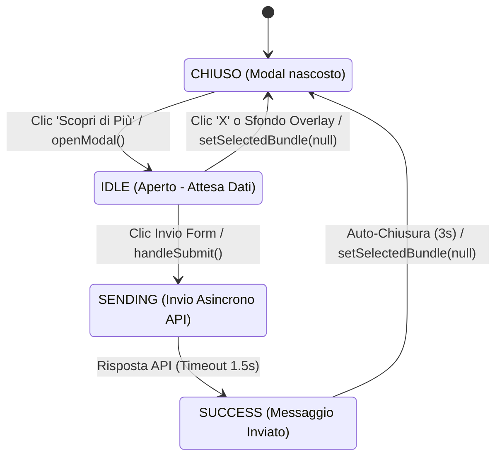
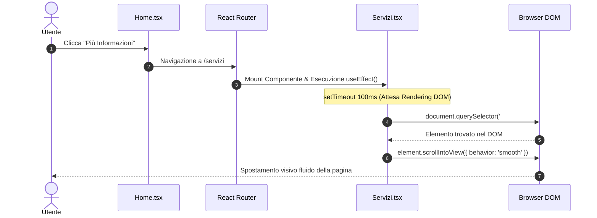
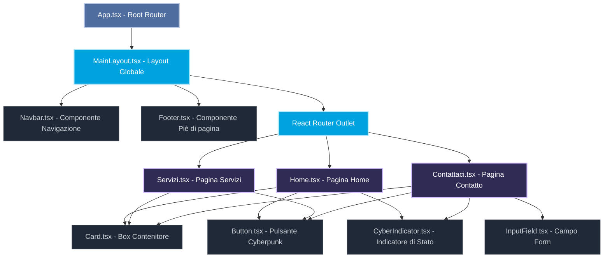
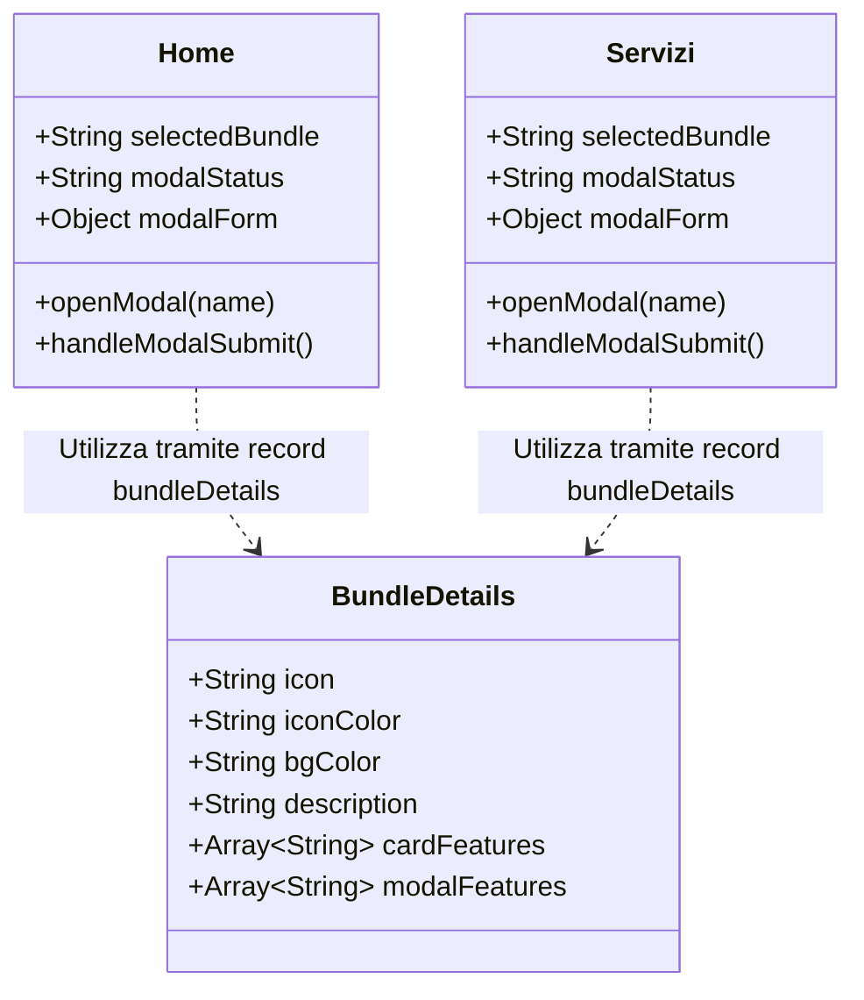
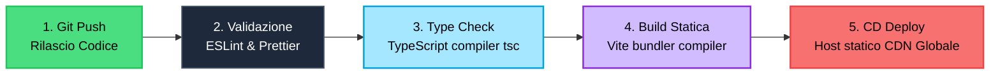

# Guida Didattica, Analisi del Codice e Architettura: FounDreams

Benvenuti in questa guida tecnica esaustiva del progetto **FounDreams** ("Visione Digitale"). Questo documento è stato concepito con una duplice veste:
1. **Didattica (ITS)**: Spiegare i concetti di programmazione web con React, TypeScript e Tailwind CSS passo dopo passo, analizzando ogni singolo blocco di codice in dettaglio.
2. **Professionale (DevOps)**: Giustificare le scelte architetturali, la configurazione degli strumenti di sviluppo, la gestione del ciclo di vita del software e l'ottimizzazione del codice per la produzione.

---

## 1. La Struttura delle Cartelle (Workspace)

Ecco come è strutturato il progetto e perché ogni file si trova in quella specifica posizione:

```text
sito-web-FounDreams/
├── index.html                   # Entry point HTML dell'applicazione
├── package.json                 # Manifesto Node.js, script e dipendenze
├── tsconfig.json                # Configurazione principale di TypeScript
├── vite.config.ts               # File di configurazione di Vite (compiler/bundler)
├── DESIGN.md                    # Documento di specifiche ed esportazione Stitch
├── src/                         # Directory principale del codice sorgente
│   ├── main.tsx                 # Entry point JavaScript/React
│   ├── App.tsx                  # Componente Root con configurazione del routing
│   ├── index.css                # Foglio di stile principale e variabili CSS
│   ├── components/              # Componenti atomici riutilizzabili (UI kit)
│   │   ├── Button.tsx           # Pulsante modulare con varianti grafiche
│   │   ├── Card.tsx             # Scheda con effetto Glassmorphism e animazione hover
│   │   ├── Chip.tsx             # Badge informativi per tag e parole chiave
│   │   ├── CyberIndicator.tsx   # Indicatore cyberpunk per lo stato di sicurezza/attività
│   │   └── InputField.tsx       # Input controllato e accessibile per i form
│   ├── layouts/                 # Frame persistenti per l'interfaccia utente
│   │   └── MainLayout.tsx       # Layout globale con Navbar responsiva e Footer
│   └── pages/                   # Viste di pagina complete (nodi del router)
│       ├── Home.tsx             # Pagina Home (Hero, Presentazione, Servizi rapidi)
│       ├── Servizi.tsx          # Pagina Servizi (Approfondimento delle competenze)
│       └── Contattaci.tsx       # Pagina Contatto (Bento Grid e form interattivo)
```

---

## 2. Analisi Dettagliata dei File di Inizializzazione

### `src/main.tsx`
È il punto di ingresso dell'applicazione JavaScript. Il browser carica questo file per dare vita al framework React.

```typescript
import { StrictMode } from 'react'
import { createRoot } from 'react-dom/client'
import './index.css'
import App from './App.tsx'

createRoot(document.getElementById('root')!).render(
  <StrictMode>
    <App />
  </StrictMode>,
)
```

#### Spiegazione Dettagliata del Codice:
1. `import { StrictMode } from 'react'`: Importa una speciale utility di React che verifica in fase di sviluppo la presenza di codice legacy o di bug legati al ciclo di vita dei componenti (es. effetti collaterali non ripuliti).
2. `import { createRoot } from 'react-dom/client'`: Carica il motore di rendering per il browser. `createRoot` è l'API introdotta in React 18 per gestire il rendering asincrono e la gestione concorrente delle viste.
3. `import './index.css'`: Importa gli stili CSS globali dell'applicazione, inclusi Tailwind e i token di design.
4. `document.getElementById('root')!`: Trova nel file `index.html` l'elemento contenitore con `id="root"`. Il punto esclamativo finale `!` è l'operatore di **asserzione non-null** di TypeScript: assicura al compilatore che l'elemento esiste e non è `null`.
5. `createRoot(...).render(...)`: Monta il componente radice dell'applicazione (`<App />`) dentro l'elemento del DOM individuato.

---

### `src/App.tsx`
Configura il sistema di routing per abilitare la navigazione a pagina singola (SPA) senza ricaricamento del browser.

```typescript
import React from 'react';
import { BrowserRouter as Router, Routes, Route } from 'react-router-dom';
import { MainLayout } from './layouts/MainLayout';
import { Home } from './pages/Home';
import { Servizi } from './pages/Servizi';
import { Contattaci } from './pages/Contattaci';

const App: React.FC = () => {
  return (
    <Router>
      <Routes>
        <Route path="/" element={<MainLayout />}>
          <Route index element={<Home />} />
          <Route path="servizi" element={<Servizi />} />
          <Route path="contattaci" element={<Contattaci />} />
        </Route>
      </Routes>
    </Router>
  );
};

export default App;
```

#### Spiegazione Dettagliata del Codice:
1. `React.FC`: Definisce il tipo del componente come `Functional Component`. Garantisce che la funzione restituisca codice JSX valido e supporti proprietà tipizzate.
2. `<Router>` (alias di `BrowserRouter`): Avvolge l'intera applicazione per sincronizzare l'interfaccia utente con l'URL del browser sfruttando l'API History di HTML5.
3. `<Routes>`: Funge da contenitore intelligente. Analizza l'URL corrente del browser e renderizza l'unico tag `<Route>` che corrisponde al percorso (path).
4. `<Route path="/" element={<MainLayout />}>`: Definisce la rotta radice. Essendo una rotta "padre", carica il layout principale persistente (`MainLayout`).
5. `<Route index element={<Home />} />`: La parola chiave `index` indica che se l'utente naviga esattamente sulla rotta radice `/`, all'interno del layout padre verrà mostrato il componente `Home`.
6. `<Route path="servizi" ... />` e `<Route path="contattaci" ... />`: Registrano i percorsi relativi `/servizi` e `/contattaci`, montando rispettivamente le pagine `Servizi` e `Contattaci`.

---

## 3. Analisi Dettagliata dei Componenti Ripetibili (`src/components/`)

### `src/components/Button.tsx`
Pulsante interattivo che implementa il design system di FounDreams con transizioni dinamiche.

```typescript
import React from 'react';

type ButtonVariant = 'primary' | 'secondary' | 'ghost';

interface ButtonProps extends React.ButtonHTMLAttributes<HTMLButtonElement> {
  variant?: ButtonVariant;
  children: React.ReactNode;
}

export const Button: React.FC<ButtonProps> = ({
  variant = 'primary',
  children,
  className = '',
  ...props
}) => {
  const baseStyles = {
    display: 'inline-flex',
    alignItems: 'center',
    justifyContent: 'center',
    padding: '12px 24px',
    borderRadius: 'var(--rounded-default)',
    fontFamily: 'var(--font-family-body)',
    fontSize: '16px',
    fontWeight: 600,
    cursor: 'pointer',
    transition: 'all 0.3s ease',
    border: 'none',
    outline: 'none',
  };

  const getVariantStyles = () => {
    switch (variant) {
      case 'primary':
        return {
          background: 'linear-gradient(90deg, var(--color-secondary), var(--color-tertiary))',
          color: 'var(--color-on-primary)',
          boxShadow: '0 4px 15px rgba(165, 231, 255, 0.2)',
        };
      case 'secondary':
        return {
          background: 'transparent',
          border: '1px solid var(--color-outline-variant)',
          color: 'var(--color-secondary)',
        };
      case 'ghost':
        return {
          background: 'transparent',
          color: 'var(--color-on-surface)',
        };
      default:
        return {};
    }
  };

  return (
    <button
      style={{ ...baseStyles, ...getVariantStyles() }}
      className={`btn-${variant} ${className}`}
      onMouseEnter={(e) => {
        if (variant === 'primary') {
          e.currentTarget.style.transform = 'scale(1.02)';
          e.currentTarget.style.boxShadow = '0 6px 20px rgba(165, 231, 255, 0.4)';
        } else if (variant === 'secondary') {
          e.currentTarget.style.borderColor = 'var(--color-secondary)';
          e.currentTarget.style.boxShadow = '0 0 10px rgba(165, 231, 255, 0.2)';
        }
      }}
      onMouseLeave={(e) => {
        if (variant === 'primary') {
          e.currentTarget.style.transform = 'scale(1)';
          e.currentTarget.style.boxShadow = '0 4px 15px rgba(165, 231, 255, 0.2)';
        } else if (variant === 'secondary') {
          e.currentTarget.style.borderColor = 'var(--color-outline-variant)';
          e.currentTarget.style.boxShadow = 'none';
        }
      }}
      {...props}
    >
      {children}
    </button>
  );
};
```

#### Spiegazione Dettagliata del Codice:
1. `type ButtonVariant = 'primary' | 'secondary' | 'ghost'`: Unione di stringhe letterali in TypeScript. Impedisce di passare varianti grafiche non supportate, garantendo la coerenza grafica del design.
2. `interface ButtonProps extends React.ButtonHTMLAttributes<...>`: Eredita tutti gli attributi HTML nativi di un bottone (es. `disabled`, `type="submit"`, `onClick`).
3. `...props`: Utilizza l'operatore di **spread** per catturare tutte le altre proprietà non dichiarate esplicitamente (come gli eventi di clic) e applicarle direttamente all'elemento `<button>` sottostante.
4. `getVariantStyles()`: Calcola l'oggetto di stile appropriato leggendo le variabili CSS dichiarate in `:root`. La variante `primary` impiega un gradiente lineare che unisce Electric Blue e Vivid Violet.
5. `onMouseEnter` e `onMouseLeave`: Gestiscono l'effetto di ingrandimento (`scale(1.02)`) ed estensione dell'ombra proiettata all'ingresso del cursore del mouse, e il loro ripristino all'uscita, garantendo micro-interazioni estremamente fluide.

---

### `src/components/Card.tsx`
Un contenitore semantico strutturato con l'effetto Glassmorphism (sfocatura dello sfondo stile vetro smerigliato).

```typescript
import React from 'react';

interface CardProps {
  children: React.ReactNode;
  title?: string;
  className?: string;
}

export const Card: React.FC<CardProps> = ({ children, title, className = '' }) => {
  return (
    <div
      className={`glass-card ${className}`}
      style={{
        background: 'var(--glass-bg)',
        backdropFilter: 'var(--glass-blur)',
        WebkitBackdropFilter: 'var(--glass-blur)',
        border: '1px solid var(--glass-border)',
        borderRadius: 'var(--rounded-lg)',
        padding: 'var(--spacing-md)',
        transition: 'all 0.3s ease',
        display: 'flex',
        flexDirection: 'column',
        gap: 'var(--spacing-sm)',
        textAlign: 'left',
      }}
      onMouseEnter={(e) => {
        e.currentTarget.style.boxShadow = 'var(--shadow-interactive)';
        e.currentTarget.style.transform = 'translateY(-4px)';
      }}
      onMouseLeave={(e) => {
        e.currentTarget.style.boxShadow = 'none';
        e.currentTarget.style.transform = 'translateY(0)';
      }}
    >
      {title && (
        <h3
          className="headline-md"
          style={{ marginBottom: 'var(--spacing-xs)', color: 'var(--color-on-surface)' }}
        >
          {title}
        </h3>
      )}
      <div style={{ color: 'var(--color-on-surface-variant)' }}>
        {children}
      </div>
    </div>
  );
};
```

#### Spiegazione Dettagliata del Codice:
1. `backdropFilter: 'var(--glass-blur)'`: Proprietà CSS chiave. Sfoca tutto ciò che si trova graficamente dietro la card.
2. `WebkitBackdropFilter`: Garantisce la retrocompatibilità dell'effetto sfocatura su browser basati su WebKit (come Safari per macOS e iOS).
3. `onMouseEnter`: Modifica imperativamente lo stile del DOM applicando un'ombra interattiva colorata (`var(--shadow-interactive)`) e una traslazione verticale verso l'alto (`translateY(-4px)`), sollevando visivamente la card.
4. `{title && ( ... )}`: Costrutto di rendering condizionale in React. Se la proprietà `title` è stata passata al componente, renderizza l'intestazione `<h3>`, altrimenti la ignora del tutto evitando tag vuoti nel DOM.

---

### `src/components/InputField.tsx`
Un campo di input strutturato e accessibile, con gestione dello stato del focus.

```typescript
import React, { useState } from 'react';

interface InputFieldProps extends React.InputHTMLAttributes<HTMLInputElement> {
  label: string;
}

export const InputField: React.FC<InputFieldProps> = ({ label, id, className = '', ...props }) => {
  const [isFocused, setIsFocused] = useState(false);
  const inputId = id || `input-${label.replace(/\s+/g, '-').toLowerCase()}`;

  return (
    <div style={{ display: 'flex', flexDirection: 'column', gap: 'var(--spacing-xs)', width: '100%', textAlign: 'left' }} className={className}>
      <label htmlFor={inputId} className="label-md" style={{ color: 'var(--color-on-surface)' }}>
        {label}
      </label>
      <input
        id={inputId}
        onFocus={(e) => {
          setIsFocused(true);
          if (props.onFocus) props.onFocus(e);
        }}
        onBlur={(e) => {
          setIsFocused(false);
          if (props.onBlur) props.onBlur(e);
        }}
        style={{
          background: 'var(--color-surface-container-high)',
          border: `1px solid ${isFocused ? 'var(--color-secondary)' : 'var(--color-outline-variant)'}`,
          borderRadius: 'var(--rounded-default)',
          padding: '12px 16px',
          color: 'var(--color-on-surface)',
          fontFamily: 'var(--font-family-body)',
          fontSize: '16px',
          outline: 'none',
          transition: 'all 0.3s ease',
          boxShadow: isFocused ? '0 0 8px rgba(165, 231, 255, 0.3)' : 'none',
        }}
        {...props}
      />
    </div>
  );
};
```

#### Spiegazione Dettagliata del Codice:
1. `const [isFocused, setIsFocused] = useState(false)`: Hook di stato. Memorizza se l'utente ha cliccato sul campo di testo ed è pronto a scrivere.
2. `label.replace(/\s+/g, '-').toLowerCase()`: Espressione regolare (Regex). Sostituisce gli spazi con trattini e rende il testo minuscolo per generare un ID HTML valido per il browser (es. "Nome Completo" diventa "input-nome-completo").
3. `htmlFor={inputId}` e `id={inputId}`: Collegano semanticamente la label al relativo input. È un requisito fondamentale per le specifiche di accessibilità WAI-ARIA (consente agli screen reader di leggere la label quando l'input riceve il focus).
4. `border: ... isFocused ? 'var(--color-secondary)' : ...`: Operatore ternario per lo stile condizionale. Se `isFocused` è vero, il bordo si colora di Electric Blue e viene applicata un'ombra sfumata neon di contorno.

---

### `src/components/CyberIndicator.tsx`
Un indicatore di stato con ombreggiatura al neon e icone dinamiche.

```typescript
import React from 'react';
import { ShieldCheck, Activity, Zap } from 'lucide-react';

export type IndicatorStatus = 'secure' | 'live' | 'processing';

interface CyberIndicatorProps {
  status: IndicatorStatus;
  label?: string;
}

export const CyberIndicator: React.FC<CyberIndicatorProps> = ({ status, label }) => {
  const getStatusConfig = () => {
    switch (status) {
      case 'secure':
        return {
          icon: <ShieldCheck size={16} />,
          color: '#4ade80',
          glow: 'rgba(74, 222, 128, 0.4)',
          text: 'Secure',
        };
      case 'live':
        return {
          icon: <Activity size={16} />,
          color: 'var(--color-secondary)',
          glow: 'rgba(165, 231, 255, 0.4)',
          text: 'Live',
        };
      case 'processing':
        return {
          icon: <Zap size={16} />,
          color: 'var(--color-tertiary)',
          glow: 'rgba(209, 188, 255, 0.4)',
          text: 'Processing',
        };
    }
  };

  const config = getStatusConfig();
  const displayLabel = label || config.text;

  return (
    <div
      style={{
        display: 'inline-flex',
        alignItems: 'center',
        gap: '8px',
        padding: '4px 12px',
        background: 'rgba(0,0,0,0.3)',
        border: `1px solid ${config.color}`,
        borderRadius: 'var(--rounded-sm)',
        color: config.color,
        fontFamily: 'var(--font-family-mono)',
        fontSize: '12px',
        textTransform: 'uppercase',
        letterSpacing: '0.05em',
        boxShadow: `0 0 8px ${config.glow}, inset 0 0 4px ${config.glow}`,
      }}
    >
      <span style={{ display: 'flex', alignItems: 'center' }}>
        {config.icon}
      </span>
      <span>{displayLabel}</span>
    </div>
  );
};
```

#### Spiegazione Dettagliata del Codice:
1. `Lucide Icons (`ShieldCheck`, `Activity`, `Zap`)`: Libreria di icone vettoriali ultraleggera e configurabile via props (`size={16}`).
2. `boxShadow: 0 0 8px ..., inset 0 0 4px ...`: Crea un doppio effetto bagliore: un'ombra esterna neon sfumata ed un'ombra interna per riempire il badge con una luce diffusa.
3. `fontFamily: 'var(--font-family-mono)'`: Forza l'utilizzo di caratteri a spaziatura fissa (Monospace) per dare un aspetto tecnologico e da "terminale di sicurezza".

---

## 4. Analisi del Layout Globale (`src/layouts/MainLayout.tsx`)

Questo componente implementa lo scheletro comune del sito: l'Header con effetto vetro sfocato, la Navbar reattiva (con supporto per dispositivi mobili) e il Footer.

```typescript
import React, { useState } from 'react';
import { Outlet, Link, useLocation } from 'react-router-dom';

export const MainLayout: React.FC = () => {
  const location = useLocation();
  const [mobileMenuOpen, setMobileMenuOpen] = useState(false);

  const getLinkClass = (path: string) => {
    const isActive = location.pathname === path;
    return isActive
      ? "text-primary dark:text-primary font-bold border-b-2 border-primary font-label-md text-label-md py-1"
      : "text-on-surface-variant dark:text-on-surface-variant hover:text-primary dark:hover:text-primary transition-colors duration-200 font-label-md text-label-md py-1";
  };

  return (
    <div className="min-h-screen flex flex-col pt-[72px]">
      <nav className="fixed top-0 left-0 w-full z-50 flex justify-between items-center px-margin-mobile md:px-margin-desktop py-base max-w-full mx-auto bg-surface/80 dark:bg-surface/80 backdrop-blur-md border-b border-white/10 dark:border-white/10 shadow-sm">
        <Link to="/" style={{ textDecoration: 'none' }}>
          <div className="font-headline-md text-headline-md font-bold text-on-surface dark:text-on-surface cursor-pointer">
            FounDreams
          </div>
        </Link>
        
        {/* Desktop Menu */}
        <div className="hidden md:flex gap-md items-center">
          <Link className={getLinkClass('/')} to="/">Home</Link>
          <Link className={getLinkClass('/servizi')} to="/servizi">Servizi</Link>
          <Link className={getLinkClass('/contattaci')} to="/contattaci">Contattaci</Link>
          <Link to="/contattaci" style={{ textDecoration: 'none' }}>
            <button className="bg-primary text-on-primary px-md py-sm rounded-full font-label-md text-label-md scale-95 active:scale-90 transition-transform hover:opacity-90">
              Inizia Progetto
            </button>
          </Link>
        </div>

        {/* Mobile Hamburger Button */}
        <button 
          className="md:hidden text-on-surface flex items-center" 
          onClick={() => setMobileMenuOpen(!mobileMenuOpen)}
        >
          <span className="material-symbols-outlined">{mobileMenuOpen ? 'close' : 'menu'}</span>
        </button>

        {/* Mobile Dropdown Menu */}
        {mobileMenuOpen && (
          <div className="absolute top-[57px] left-0 w-full bg-surface border-b border-white/10 flex flex-col p-md gap-md md:hidden z-40">
            <Link className={getLinkClass('/')} to="/" onClick={() => setMobileMenuOpen(false)}>Home</Link>
            <Link className={getLinkClass('/servizi')} to="/servizi" onClick={() => setMobileMenuOpen(false)}>Servizi</Link>
            <Link className={getLinkClass('/contattaci')} to="/contattaci" onClick={() => setMobileMenuOpen(false)}>Contattaci</Link>
            <Link to="/contattaci" style={{ textDecoration: 'none' }} onClick={() => setMobileMenuOpen(false)}>
              <button className="bg-primary text-on-primary px-md py-sm rounded-full font-label-md text-label-md w-full">
                Inizia Progetto
              </button>
            </Link>
          </div>
        )}
      </nav>

      <main className="flex-grow">
        <Outlet />
      </main>

      {/* Footer... */}
    </div>
  );
};
```

#### Spiegazione Dettagliata del Codice:
1. `useLocation()`: Restituisce l'oggetto `location` corrente della cronologia di navigazione del router. Viene usato per calcolare la classe dei link attivi.
2. `getLinkClass(path)`: Funzione che confronta `location.pathname` con il percorso del link. Se combaciano, applica classi CSS di attivazione (bordo inferiore visibile e colore di evidenziazione), altrimenti restituisce lo stile standard.
3. `fixed top-0 left-0 w-full z-50`: Fissa la Navbar in cima alla pagina sopra qualsiasi altro elemento (`z-50`).
4. `pt-[72px]`: Aggiunge un padding superiore al container principale pari a 72 pixel (altezza della Navbar). Questo accorgimento evita che gli elementi iniziali delle pagine vengano coperti dal menu fixed.
5. `<Outlet />`: Componente fondamentale di `react-router-dom`. Funge da "segnaposto" in cui il router andrà ad inserire dinamicamente la pagina corrente (`Home`, `Servizi` o `Contattaci`) mantenendo intatto l'header e il footer.
6. `mobileMenuOpen && ( ... )`: Operatore di cortocircuito logico `AND`. Se lo stato `mobileMenuOpen` è impostato su `true`, la tendina dei link per dispositivi mobili viene renderizzata nel DOM, altrimenti scompare.

---

## 5. Analisi delle Pagine Sorgente (`src/pages/`)

### Pagina Home (`src/pages/Home.tsx`)
Spazio interattivo con supporto ad animazioni guidate per il caricamento dinamico al passaggio delle sezioni.

```typescript
import React, { useEffect } from 'react';
import { Link } from 'react-router-dom';

export const Home: React.FC = () => {
  useEffect(() => {
    const observerOptions = {
      threshold: 0.1
    };

    const observer = new IntersectionObserver((entries) => {
      entries.forEach(entry => {
        if (entry.isIntersecting) {
          entry.target.classList.add('opacity-100', 'translate-y-0');
          entry.target.classList.remove('opacity-0', 'translate-y-10');
        }
      });
    }, observerOptions);

    const sections = document.querySelectorAll('.scroll-reveal');
    sections.forEach(section => {
      section.classList.add('transition-all', 'duration-700', 'opacity-0', 'translate-y-10');
      observer.observe(section);
    });

    return () => {
      sections.forEach(section => {
        observer.unobserve(section);
      });
    };
  }, []);

  return (
    <div className="overflow-x-hidden">
      {/* Sezione Hero... */}
      <header className="relative min-h-[calc(100vh-72px)] flex items-center pt-xl overflow-hidden">
        {/* Background gradienti ed elementi visivi... */}
      </header>
    </div>
  );
};
```

#### Spiegazione Dettagliata del Codice:
1. `const observer = new IntersectionObserver(...)`: API nativa del browser altamente efficiente. Monitora asincronamente se un elemento entra o esce dallo schermo.
2. `threshold: 0.1`: Specifica che l'animazione di svelamento si attiva non appena il 10% dell'elemento è visibile all'interno della finestra del browser.
3. `entry.isIntersecting`: Proprietà booleana dell'Intersection Observer. Diventa `true` quando l'elemento osservato si sposta all'interno del viewport di navigazione dell'utente.
4. `entry.target.classList.add('opacity-100', 'translate-y-0')`: Rende l'elemento completamente opaco e lo riporta alla sua posizione Y originale (traslazione zero).
5. `return () => { ... }`: Funzione di pulizia (cleanup) eseguita da React quando la pagina viene smontata. Disattiva il monitoraggio di tutti gli elementi per salvaguardare le prestazioni di memoria del browser.

---

### Pagina Contattaci (`src/pages/Contattaci.tsx`)
Contiene il form di contatto controllato e l'effetto di parallasse tridimensionale legato al movimento fisico del mouse.

```typescript
import React, { useEffect, useState } from 'react';

export const Contattaci: React.FC = () => {
  const [formStatus, setFormStatus] = useState<'idle' | 'sending' | 'success'>('idle');
  const [formData, setFormData] = useState({
    nome: '',
    email: '',
    oggetto: '',
    messaggio: ''
  });

  useEffect(() => {
    const handleMouseMove = (e: MouseEvent) => {
      const cards = document.querySelectorAll('.glass-card');
      const x = e.clientX / window.innerWidth;
      const y = e.clientY / window.innerHeight;
      
      cards.forEach(card => {
        const speed = 20;
        const xOffset = (x - 0.5) * speed;
        const yOffset = (y - 0.5) * speed;
        (card as HTMLElement).style.transform = `translate(${xOffset}px, ${yOffset}px)`;
      });
    };

    window.addEventListener('mousemove', handleMouseMove);
    return () => {
      window.removeEventListener('mousemove', handleMouseMove);
    };
  }, []);

  const handleSubmit = (e: React.FormEvent) => {
    e.preventDefault();
    setFormStatus('sending');

    setTimeout(() => {
      setFormStatus('success');
      setTimeout(() => {
        setFormStatus('idle');
        setFormData({ nome: '', email: '', oggetto: '', messaggio: '' });
      }, 3000);
    }, 1500);
  };

  const handleInputChange = (e: React.ChangeEvent<HTMLInputElement | HTMLTextAreaElement>) => {
    const { name, value } = e.target;
    setFormData(prev => ({ ...prev, [name]: value }));
  };

  return (
    <main className="pt-xl md:pt-32 pb-xl overflow-x-hidden">
      {/* Bento Grid con Sidebar info e Form... */}
    </main>
  );
};
```

#### Spiegazione Dettagliata del Codice:
1. `const [formStatus, setFormStatus] = useState(...)`: Stato che gestisce l'interfaccia del pulsante di invio. Può assumere i valori `'idle'` (pronto all'invio), `'sending'` (invio in corso) o `'success'` (messaggio inviato con successo).
2. `const [formData, setFormData] = useState(...)`: Gestisce il valore di tutti i campi del form. Questo approccio è chiamato **Form Controllato** in React, in cui lo stato di React è l'unica fonte di verità per i valori dei campi di input.
3. `handleInputChange`: Cattura i cambiamenti nei campi tramite il destrutturamento dell'evento (`const { name, value } = e.target`) e aggiorna lo stato React di conseguenza (`[name]: value`), senza sovrascrivere gli altri campi grazie all'operatore di spread di copia dello stato precedente (`...prev`).
4. `handleMouseMove`:
   - `e.clientX / window.innerWidth` e `e.clientY / window.innerHeight`: Normalizza la coordinata X e Y del mouse in un intervallo compreso tra `0` e `1`.
   - `(x - 0.5)` e `(y - 0.5)`: Centra l'intervallo intorno allo zero (diventando da `-0.5` a `0.5`). Se il mouse è al centro dello schermo, i valori saranno pari a `0`.
   - `(card as HTMLElement).style.transform = ...`: Esegue un cast di tipo TypeScript per informare il compilatore che l'elemento è un elemento HTML generico che espone la proprietà `.style`. Applica una trasformazione CSS di tipo `translate` moltiplicando per il fattore `speed` per muovere in modo fluido le card di vetro.
5. `window.addEventListener('mousemove', ...)` e `removeEventListener(...)`: Registrano il monitoraggio del mouse a livello globale e rimuovono il listener non appena l'utente lascia la pagina dei contatti, garantendo l'assenza di memory leak nel browser.

---

## 6. Il Foglio di Stile e l'Integrazione di Design System (`src/index.css`)

Il file `index.css` è il ponte tra i token del design Stitch e lo sviluppo frontend.

```css
@import url('https://fonts.googleapis.com/css2?family=Inter:wght@400;500;600&family=Outfit:wght@400;600;700;800&display=swap');

:root {
  /* Token Colori */
  --color-surface: #101415;
  --color-on-surface: #e0e3e5;
  --color-on-surface-variant: #c5c6cd;
  --color-outline-variant: #44474d;
  --color-primary: #b9c7e4;
  --color-secondary: #a5e7ff;
  --color-tertiary: #d1bcff;

  /* Font Families */
  --font-family-body: 'Inter', sans-serif;
  --font-family-headline: 'Outfit', sans-serif;

  /* Glassmorphism */
  --glass-bg: rgba(29, 32, 34, 0.6);
  --glass-border: rgba(255, 255, 255, 0.08);
  --glass-blur: blur(12px);

  /* Shadows */
  --shadow-interactive: 0 10px 40px rgba(165, 231, 255, 0.15);
}
```

#### Spiegazione Dettagliata del Codice:
1. `@import url(...)`: Carica le famiglie di caratteri tipografici Outfit ed Inter da Google Fonts.
2. `:root`: Rappresenta l'elemento radice dell'intero documento HTML. Dichiarare le variabili CSS qui le rende accessibili a qualsiasi file di stile o componente all'interno dell'applicazione.
3. `--glass-bg: rgba(29, 32, 34, 0.6)`: Specifica il colore di sfondo per l'effetto vetro utilizzando il formato RGBA. La trasparenza è impostata al `60%` (`0.6`) per consentire la parziale visibilità degli elementi posti sullo sfondo.
4. `--shadow-interactive`: Ombra personalizzata creata per reagire all'ingresso del cursore del mouse, impostando un colore Electric Blue semi-trasparente (`rgba(165, 231, 255, 0.15)`) per simulare un bagliore neon.
5. In questo modo, l'intero tema dell'applicazione è centralizzato in un unico file CSS per facilitare la manutenzione futura ed eventuali rebranding.

---

## 7. I Modali di Conversione e il Form di Contatto In-Place

Nelle ultime fasi di sviluppo del progetto **FounDreams**, abbiamo introdotto un sistema avanzato di modali interattive direttamente collegate alle card dei pacchetti ("Startup Bundle", "Business Evolution", "Enterprise Safe") sia nella `Home.tsx` che in `Servizi.tsx`. 

Questa scelta risponde a un'importante metrica di UX e Digital Marketing: la **conversione in-place** (sul posto). Invece di costringere l'utente a interrompere la lettura per navigare verso una pagina di contatto separata, gli permettiamo di richiedere informazioni con un solo clic mantenendo il contesto del pacchetto scelto.

### 7.1 Il Diagramma di Stato del Form nel Modal

Ecco l'infografica che illustra il ciclo di vita del modal e i cambi di stato gestiti da React:




---

### 7.2 Architettura del Codice e Spiegazione Didattica

L'implementazione si basa sulla gestione centralizzata dello stato all'interno dei file di pagina (`Home.tsx` e `Servizi.tsx`). Vediamo come viene strutturata e gestita questa interazione:

#### A. Inizializzazione dello Stato del Modal
```typescript
const [selectedBundle, setSelectedBundle] = useState<string | null>(null);
const [modalStatus, setModalStatus] = useState<'idle' | 'sending' | 'success'>('idle');
const [modalForm, setModalForm] = useState({
  nome: '',
  email: '',
  oggetto: '',
  messaggio: ''
});
```

*Didattica per ITS:* 
1. `selectedBundle` memorizza il nome del pacchetto selezionato (es. `"Startup Bundle"`). Se è `null`, il modal è chiuso e non viene renderizzato nel DOM.
2. `modalStatus` traccia lo stato del form per aggiornare l'interfaccia utente (mostrando uno spinner di caricamento o una schermata di successo con spunta verde).
3. `modalForm` rappresenta lo stato del form controllato in React.

#### B. Apertura Dinamica con Pre-compilazione (`openModal`)
```typescript
const openModal = (bundleName: string) => {
  setSelectedBundle(bundleName);
  setModalForm({
    nome: '',
    email: '',
    oggetto: `Richiesta preventivo per ${bundleName}`,
    messaggio: `Ciao! Sono interessato al pacchetto ${bundleName}. Vorrei ricevere maggiori informazioni.`
  });
  setModalStatus('idle');
};
```
*Didattica per ITS:* 
Quando l'utente clicca su "Scopri di Più", passiamo il nome del pacchetto alla funzione `openModal`. Questa funzione non si limita ad aprire il popup impostando `selectedBundle`, ma precompila in automatico l'**Oggetto** ed il **Messaggio** iniziale del form. Questo riduce notevolmente l'attrito cognitivo per l'utente, che deve solo inserire il proprio nome ed indirizzo email.

#### C. Gestione degli Eventi e Chiusura (`e.stopPropagation()`)
Nel JSX del modal, usiamo questa struttura:
```tsx
<div 
  className="fixed inset-0 z-[100] flex items-start justify-center ..."
  onClick={() => setSelectedBundle(null)} // Chiude il modal cliccando fuori
>
  <div 
    className="modal-content glass relative ..."
    onClick={(e) => e.stopPropagation()} // Previene la chiusura cliccando all'interno
  >
    {/* Contenuto del Modal */}
  </div>
</div>
```
*Didattica per ITS:* 
L'evento click sul contenitore esterno (l'overlay sfocato di sfondo) imposta `selectedBundle` a `null`, chiudendo di fatto il modal. Tuttavia, per evitare che cliccando all'interno del modal (sui campi di testo, bottoni, ecc.) il popup si chiuda involontariamente, dobbiamo chiamare `e.stopPropagation()`. Questa istruzione ferma la propagazione dell'evento (il cosiddetto *Event Bubbling* o risalita degli eventi nel DOM) verso gli elementi genitori.

#### D. Layout Responsivo e Accessibile (`items-start`)
Inizialmente, l'overlay del modal utilizzava `items-center` per centrare verticalmente la card. In scenari con schermi di altezza ridotta (come portatili da 13 pollici o telefoni cellulari), la card del modal, essendo molto alta a causa del form di contatto, veniva tagliata in alto e in basso, rendendo il pulsante di chiusura **"X"** non raggiungibile.

Abbiamo risolto questo bug di usabilità applicando le classi Tailwind:
- `items-start`: allinea la card all'inizio dello schermo.
- `pt-12 pb-12`: aggiunge un margine verticale di sicurezza.
- `overflow-y-auto`: abilita la barra di scorrimento sul contenitore overlay se l'altezza della card supera quella dello schermo.

Il pulsante di chiusura **"X"** è posizionato in modo assoluto e contrassegnato con `z-50` per rimanere sempre in primo piano e cliccabile sopra la card di vetro smerigliato:
```tsx
<button 
  onClick={() => setSelectedBundle(null)}
  className="absolute top-4 right-4 text-on-surface/70 hover:text-primary transition-colors focus:outline-none z-50"
  aria-label="Chiudi"
>
  <span className="material-symbols-outlined text-[28px]">close</span>
</button>
```

---

## 8. Navigazione Avanzata con Hash e Scorrimento Fluido (Smooth Anchor Scroll)

Un'altra importante ottimizzazione introdotta riguarda il collegamento tra la Home Page e la pagina dei Servizi dettagliati. Quando un utente si trova sulla Home e clicca su "Più informazioni" nella sezione di un servizio specifico (ad esempio "Siti Web ad Alte Prestazioni"), l'applicazione lo reindirizza alla pagina `/servizi` e si posiziona automaticamente sulla sezione corrispondente tramite uno scorrimento fluido.

Ecco l'infografica che traccia il percorso logico del sistema di routing e scorrimento:




---

### 8.2 Analisi del Codice di Scorrimento

La logica si divide in due componenti principali:

#### A. I Link Anchor nella Home Page
```tsx
<Link to="/servizi#siti-web" style={{ textDecoration: 'none' }}>
  <button className="flex items-center gap-xs text-primary ...">
    Più informazioni <span className="material-symbols-outlined text-[18px]">arrow_forward</span>
  </button>
</Link>
```
*Didattica per ITS:*
Il tag `<Link>` di React Router punta al percorso `/servizi` includendo un hash (`#siti-web`). Questo hash indica al browser che vogliamo fare riferimento a un punto di ancoraggio specifico all'interno della pagina di arrivo.

#### B. La Gestione degli ID in `Servizi.tsx`
Ciascuna sezione corrispondente in `Servizi.tsx` è stata dotata dello stesso ID univoco:
```tsx
<section id="siti-web" className="scroll-reveal py-xl bg-surface ...">
```

#### C. L'Hook di Gestione Ciclo di Vita (`useEffect`)
Poiché le Single Page Application modificano il DOM dinamicamente senza ricaricare l'intera pagina HTML, il browser non esegue nativamente lo scorrimento automatico al caricamento dell'ancora. Dobbiamo gestirlo programmaticamente:

```typescript
useEffect(() => {
  const hash = window.location.hash;
  if (hash) {
    // Un piccolo timeout garantisce che il DOM sia stato completamente renderizzato
    setTimeout(() => {
      const element = document.querySelector(hash);
      if (element) {
        element.scrollIntoView({ behavior: 'smooth', block: 'start' });
      }
    }, 100);
  }
}, []);
```

*Spiegazione del codice passo-passo per ITS:*
1. `const hash = window.location.hash;`: Legge la parte finale dell'URL corrente. Ad esempio, se l'URL è `http://localhost:5174/servizi#siti-web`, la variabile `hash` conterrà la stringa `"#siti-web"`.
2. `if (hash)`: Verifica se è presente un hash nell'URL. Se non c'è, non fa nulla.
3. `setTimeout(..., 100)`: Questo è un passaggio fondamentale sotto il profilo DevOps/Ingegneristico. React monta i componenti in modo asincrono. Se provassimo a cercare l'elemento immediatamente, `document.querySelector(hash)` potrebbe restituire `null` poiché il browser non ha ancora finito di disegnare l'elemento sullo schermo. Impostando una frazione di secondo di attesa (100 millisecondi), diamo il tempo al thread grafico del browser di completare il rendering iniziale.
4. `document.querySelector(hash)`: Utilizza le API native del browser per trovare l'elemento HTML che possiede l'ID corrispondente all'hash (es. `<section id="siti-web">`).
5. `element.scrollIntoView({ behavior: 'smooth', block: 'start' })`: Avvia l'animazione di scorrimento nativa ed efficiente del browser.
   - `behavior: 'smooth'`: fa scivolare la pagina in modo fluido anziché saltare istantaneamente alla sezione.
   - `block: 'start'`: posiziona la parte superiore della sezione selezionata esattamente all'inizio dello schermo dell'utente.
6. `[],`: L'array delle dipendenze vuoto indica a React che questo effetto deve essere eseguito una sola volta, quando il componente `Servizi` viene inizialmente montato (caricato) a schermo.

---

## 9. Schemi Progettuali e Architettura del Software

Per concludere questa trattazione accademica e professionale, presentiamo una serie di schemi architetturali e di design che rappresentano la struttura logica e fisica dell'applicazione **FounDreams**. 

> [!NOTE]
> **Rendering Nativo:** Gli schemi seguenti sono scritti in formato **Mermaid.js**. Molti editor markdown moderni (tra cui VS Code con apposite estensioni o GitHub/GitLab) li renderizzano nativamente in forma di diagrammi di alta qualità, facilitandone la lettura e la futura manutenzione.

### 9.1 La Gerarchia dei Componenti (Component Tree)

Questo diagramma ad albero mostra le relazioni di inclusione e di parentela tra i vari file JSX/TSX del progetto:




---

### 9.2 Modello dei Dati dei Pacchetti (Data Model & Schema)

Il nucleo informativo per la gestione dei pacchetti commerciali (Startup, Business, Enterprise) è strutturato come un dizionario tipizzato (oggetto chiave-valore). Questo diagramma delle classi illustra la tipizzazione TypeScript dell'oggetto `bundleDetails` e le relazioni di dipendenza con i componenti di pagina che lo consumano per popolare sia il layout delle card sia i modal di dettaglio.




*Spiegazione didattica per ITS:*
Il dizionario dei pacchetti utilizza il tipo di utilità di TypeScript `Record<string, BundleDetails>`. Questo assicura che qualsiasi chiave stringa utilizzata all'interno dell'oggetto (ad esempio `"Startup Bundle"`) restituisca obbligatoriamente un oggetto che rispetta lo schema e la forma definiti dall'interfaccia `BundleDetails`, prevenendo errori a runtime in caso di chiavi o proprietà mancanti (es. proprietà `modalFeatures` non compilate).

---

### 9.3 Pipeline DevOps per il Rilascio Continuo (CI/CD)

Sotto il profilo ingegneristico e DevOps, un'applicazione web moderna deve essere validata e rilasciata in modo totalmente automatico. Ecco lo schema della pipeline che descrive il ciclo di vita dall'invio del codice alla pubblicazione dell'artefatto statico:




*Analisi Ingegneristica:*
1. **Static Analysis & Compilazione (`tsc -b`)**: Prima di procedere alla compilazione dei file statici, il compilatore di TypeScript controlla la coerenza dei tipi nell'intera base di codice. Se viene rilevata un'incongruenza, la pipeline fallisce immediatamente, bloccando il rilascio di codice difettoso.
2. **Bundling Ottimizzato (`vite build`)**: Vite compila i file TypeScript e JSX traducendoli in HTML, CSS e JavaScript standard (ES6+). Durante questo processo, esegue operazioni di **Tree-Shaking** (eliminazione di codice importato ma inutilizzato) e **Minification** (rimozione di spazi bianchi, commenti e compressione dei nomi delle variabili), riducendo il peso dei file del `90%` per massimizzare la velocità di caricamento nel browser.
3. **Distribuzione su Cloud Hosting**: Trattandosi di una SPA (Single Page Application) statica, la cartella `/dist` contiene solo risorse statiche pre-compilate. Non richiede un server node running a runtime e può essere servita a livello globale tramite reti CDN (Content Delivery Network), garantendo tempi di risposta inferiori a 50 millisecondi ovunque nel mondo e costi di gestione quasi nulli.


